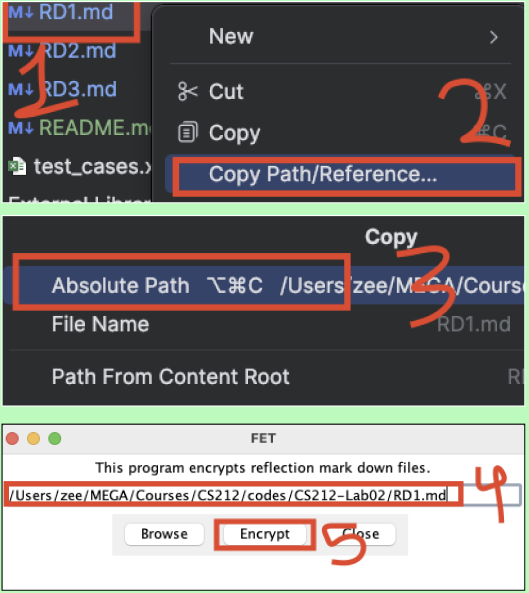

<h1> CS151 Lab XX -- Title </h1>
<h3>🔴 DO NOT Start to code before the instructor Approve your algorithm, and test cases</h3>
<h3>🔴 Grade: EMRN</h3>

<h2> Table of Contents </h2>

<!-- TOC -->
  * [`I. DEADLINES`](#i-deadlines)
  * [`II. RESOURCES`](#ii-resources)
  * [`III PROBLEM`](#iii-problem)
  * [`IV PURPOSE`](#iv-purpose)
  * [`V DETAILS`](#v-details)
    * [File details](#file-details)
    * [Input](#input-)
    * [Output](#output)
    * [Programming Details](#programming-details)
  * [`VI DESIGN`](#vi-design)
    * [Function design](#function-design-)
  * [`VII STEPS`](#vii-steps)
  * [`VIII What to Submit in GitHub`](#viii-what-to-submit-in-github)
<!-- TOC -->
<h4> 🔵 Understand the problem and Design before Coding  </h4>

**🔵 Post any questions on [Discord Lab Channel](https://discord.com/channels/1316435150527004825/1316435298166640710)**


## `I. DEADLINES`

| Deliverable | Due Date        |
|-------------|-----------------|
| Lab XX      | Before next lab |
---

## `II. RESOURCES`

- [Class Examples Repo](https://github.com/SP25-ZJY/CS151)
- [Self or Annotated Notes](https://moodle.loyola.edu/course/view.php?id=89004)
- [CS 151: Book](https://learn.zybooks.com/zybook/LOYOLACS151Spring2025)
- [Solutions To Previous Labs and PAs](https://classroom.github.com/classrooms/193636664-sp25-zjy-cs151)

**🟠 LLM-Based Codes Will Result in Penalty and Honor Code Violation 🟠**


## `III PROBLEM`
You are organizing a dinner party with assigned seats. 
- Create a program to read in all the attendees and then output the seat assignments.

## `IV PURPOSE`
This lab gives you practice with: 
* Following problem-solving techniques
* Using for loops
* Doing file I/O
* Storing data in lists
* Processing a list

## `V DETAILS`

We want to have a class dinner party at the end of the semester. 
- Catering services will provide as many tables as we need, with each table seating five people. 
- Your goal is to determine and output:
  1. How many tables are needed? 
  2. Who is sitting at each table?


### File details
You have three different files with all the students names as well as the instructor's name for each CS151 instructor.  
- There is one name per line in a file. 
- All files share the same format, so your code should work for any file without modification if written correctly!

### Input 
You must ask the user the name of the file to read the names from.
- You can then read that file to input the data from the file (i.e. Read the data from the file into a list).

### Output
 
Determine and output how many tables we will need. 
- Fortunately the `number of attendees is a multiple of 5` in each file.

We will need name signs to go at each seat. 
- Each sign should have table number, seat number and guest's name. 
- The output on seating assignments should be similar in style to:

```
~~~~~~~~~~~~~~~~~~~~~~~
Table 1, Seat 1, Jones
~~~~~~~~~~~~~~~~~~~~~~~
~~~~~~~~~~~~~~~~~~~~~~~
Table 1, Seat 2, Smith
~~~~~~~~~~~~~~~~~~~~~~~
```

### Programming Details
Your program must read in all the information stored in the file, and store it in a list before doing any processing.
- You must use for loops.
- Make sure your input/output follows good usability rules.
- Use iterative development as you design algorithm and write code. Test as you go.

## `VI DESIGN`
You must design your functions and their algorithms before you start coding. 
- Think about the tasks that need to be solved. Be sure to look back at yesterday’s notes, as the setup is much the same.
### Function design 
  Use the guidelines for creating a function
  -  **In algorithm**
  ```
  # Purpose:  [what problem does the function solve?]
  # Name: [The proposed name of the function]
  # Parameters: [list with purpose in the same order they appear in the function header]
  # Return: [return value, it's type, and what it represents]
  # Algorithm:
  ```
  - **In Code**
  ```
  # Purpose:  [what problem does the function solve?]
  # Parameters: [list with purpose in the same order they appear in the function header]
  # Return: [return value, it's type, and what it represents]
  ```

## `VII STEPS`
1. Make sure you understand the problem
2. Determine the functions you need to solve this problem. 
   - `Remember that a function solves a high level task for the program.` 
   - Then write your algorithm for the function that determines the seating arrangement 
   <br> (you do not need to write the rest of the algorithms, but you do need to figure out what functions you need). 
   - **Take turns driving. Have your design approved by the professor before you start your code.**
3. Write your code.
   - Follow iterative development like you did in design – get one part working completely before moving on to the next part. 
   - Test it as you write it! **take turns driving**
4. Test your code to make sure it is working correctly. 
   - You may need to add some extra print statements to see what values are being used, or the value of the list (remove them for your final version).  
   - **Be sure to test with all input files.**
5. Write comments in your code to make it clear what it is doing.
6. Write comments for each function in your code. 
   - Use the Function Design guidelines
7. Include an updated version of the intro comments. 
   - Note the new final line below about `Input files`. 
   - Be sure to note that you need input files that contain one name per line! 
```
# Programmers:  [your names here]
# Course:  CS151, [Instructors Name]
# Due Date: [date assignment is due]
# Lab Assignment:  [number of assignment]
# Problem Statement:  [what problem does your code solve; i.e., calculating inches from centimeters]
# Data In: [what information do you request from the user?]
# Data Out:  [What information do you display for the user?]
# Credits: [Is your code based of an example in the book, in class, or something else?  Reminder: you should never take code from the Internet or another person.]
# Input Files: [description of the format of the input files you need for this program to work]
```

## `VIII What to Submit in GitHub`

1. Completed `main.py` file  
2. `algorithm.md`
3. Encrypted reflection files using the `FET.py`
   1. `RD1.md` -> Reflection for Drive 1
   2. `RD2.md` -> Reflection for Drive 2
   3. `RD3.md` -> Reflection for Drive 3
- **Unencrypted reflection will be considered unsubmitted**
- Find the file path this way
  


**As a reminder, reflections count toward your participation grade.**

**Make sure the file in your PyCharm and Github is the same (i.e. Commit and Push)**

[<h2>⬆ Back To Top ⬆</h2>](#i-deadlines)